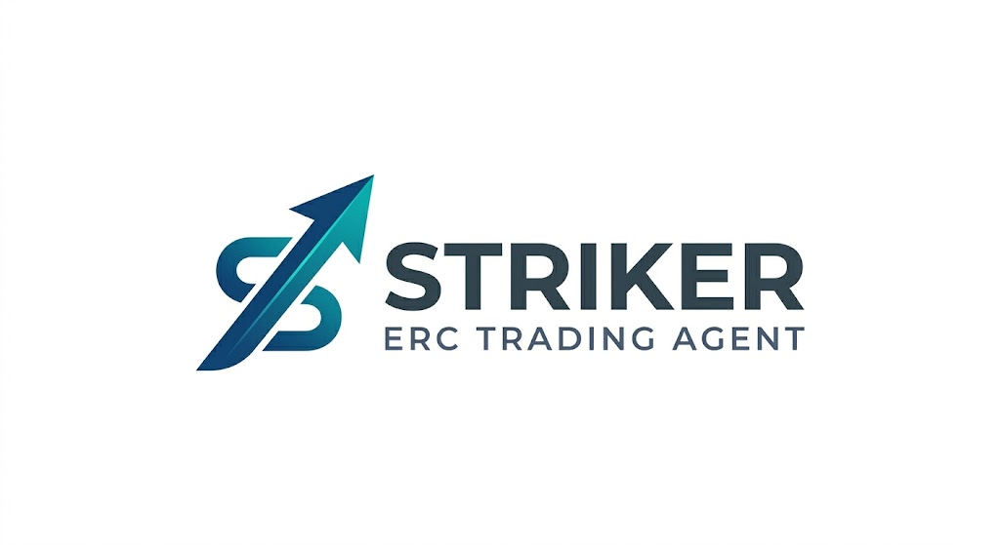

# STRIKER ⚡ Delta-Neutral Trading Agent  

*(Submission for the Lablab.ai ERC-8004 AI Trading Agents Hackathon)*



**Demo URL:** [https://cognitee-frontend.onrender.com/](https://cognitee-frontend.onrender.com/)  
**Video Presentation:** [https://www.youtube.com/watch?v=QNelSKUjlHo](https://www.youtube.com/watch?v=QNelSKUjlHo)  

---

## 📖 Short Description

Autonomous ERC-8004 AI agent using Intel TDX for secure, verifiable Delta-Neutral trading on Base.

## 🚀 Long Description

STRIKER is a verifiable ERC-8004 AI agent for Delta-Neutral trading. Operating in an Intel TDX enclave, it pairs Gemini AI with hardware security for tamper-proof strategies. STRIKER captures spot-perp spreads via secure EIP-712 intents routed through the RiskRouter. By registering as an NFT and reporting immutable P&L to the ReputationRegistry, it builds a transparent trust score. STRIKER is the blueprint for intelligent, accountable, and secure autonomous finance on-chain.

## 🛠️ Tags & Technologies

- **Track:** ERC-8004
- **Categories:** AI Trading, TEE, Delta-Neutral
- **Tech Stack:** Python 3, FastAPI, Intel TDX (dstack), Web3.py, The Graph, Phala Cloud, Anthropic/Gemini LLMs.

---

## ⚙️ Architecture & ERC-8004 Integration

```text
┌─────────────────────────────────────────────────────────────────┐
│                    PRESENTATION / DASHBOARD                     │
│  Funding Page │ Dashboard │ Chat Interface │ Trust Center       │
└─────────────────────────────────────────────────────────────────┘
                               │
                               ▼
┌─────────────────────────────────────────────────────────────────┐
│                      AGENT LAYER (STRIKER)                       │
│  BaseAgent │ ChatAgent │ ServerAgent │ DeltaNeutralEngine       │
└─────────────────────────────────────────────────────────────────┘
                               │ Action: 1. Register 2. Strategy 3. Execute 4. Feedback
                               ▼
┌─────────────────────────────────────────────────────────────────┐
│                    ERC-8004 COMPLIANCE LAYER                     │
│  Registry Client │ EIP-712 Signer │ Validation Artifacts         │
└─────────────────────────────────────────────────────────────────┘
```

1. **Agent Registration:** Agents mint an ERC-721 token representing their identity via the `IdentityRegistry`.
2. **TEE Attestation:** Secure keys derived at runtime via Intel TDX. Hardware quote confirms environment integrity.
3. **Execution (EIP-712):** Agent crafts a `TradeIntent` detailing Market, Amount, Action, MaxSlippage, and Deadline, and signs it.
4. **Validation Artifact:** STRIKER hashes the proof into a JSON artifact.
5. **Reputation (Feedback):** Posts immutable fixed-point arithmetic scores matching realized PnL back into the `ReputationRegistry`.

---

## 💻 Local Testing & Setup

Follow these steps to run STRIKER locally. You will be able to access the internal dashboard, provide sandbox capital, and witness the EIP-712 ERC-8004 transaction loop.

### 1. Prerequisites

- Python 3.12+
- A Web3 RPC (e.g. Alchemy or Infura for Base Sepolia)
- Basic environment API keys (LLMs, Subgraphs)

### 2. Installation

```bash
git clone https://github.com/YOUR_USERNAME/AITradingAgent-ERC-8004-Hackathon.git
cd AITradingAgent-ERC-8004-Hackathon
cp .env.example .env

# Edit .env with your specific API Keys
```

### 3. Execution

```bash
pip3 install -e .
python3 deployment/local_agent_server.py
```

### 4. How to use the Demo

1. Navigate to `http://localhost:8000` via your browser.
2. Complete the **Funding** simulation to load the agent's wallet with ETH.
3. Observe the **Dashboard** as the agent connects to the ERC-8004 IdentityRegistry.
4. Open the server logs. STRIKER will begin reading the mock Kraken/Prism feeds, evaluating `Spot` vs `Perp`.
5. Once the dynamic threshold is cleared by the LLM, the `TradeIntent` is signed via EIP-712, creating the ERC-8004 validation artifact and pinging the RiskRouter.

## 📜 Full Documentation

For a deep dive into the inner workings, components, and the mathematical mechanics of our Delta-Neutral strategy, check out our [DOCUMENTACION_COMPLETA.md](./docs/DOCUMENTACION_COMPLETA.md).

## 📄 License

MIT License.
